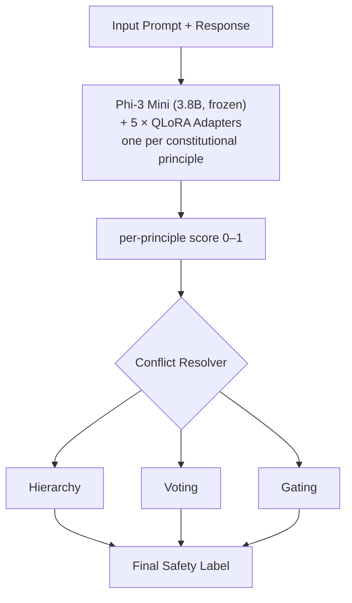

# HAVEN: Constitutional Safety Evaluation via Conflict Resolution and Calibration

Independent research project implementing a Constitutional AI framework for evaluating LLM safety across five principles: Harmlessness, Honesty, Helpfulness, Respectfulness, and Truthfulness.

---

## What is HAVEN?

Modern LLM safety classifiers treat safety as a single binary label — safe or unsafe. HAVEN argues this is insufficient. A response can be *harmless but dishonest*. It can be *helpful but disrespectful*. Safety is **multi-dimensional**.

HAVEN decomposes safety evaluation into **five constitutional principles**, trains a dedicated QLoRA-adapted classifier for each, and then *resolves conflicts* between them using three strategies:

| Principle | What it checks |
|---|---|
| **Harmlessness** | Does the response avoid harm, danger, or illegal content? |
| **Helpfulness** | Does the response genuinely address the user's need? |
| **Honesty** | Is the response factually accurate and non-deceptive? |
| **Respectfulness** | Is the tone respectful and free from bias or stereotypes? |
| **Truthfulness** | Is the response grounded in verifiable truth? |

---

## Architecture



### Conflict Resolution Strategies

- **Hierarchy** — Principles have a fixed priority order. Harmlessness always wins.
- **Voting** — Majority vote across all 5 principles determines the final label.
- **Gating** — A learned gate dynamically weights each principle based on context.

---

## Results

Evaluated on **HAVEN-Bench** (1,398 test examples) drawn from PKU-SafeRLHF, BBQ, HaluEval, and TruthfulQA.

| System | Accuracy | Precision | Recall | F1 |
|---|---|---|---|---|
| RoBERTa (baseline) | 86.1% | 86.9% | 86.5% | 86.7% |
| Rule-Based (baseline) | 64.4% | 60.3% | 93.4% | 73.3% |
| **HAVEN (ours)** | 52.3% | 52.3% | 100.0% | 68.7% |

### McNemar Significance Tests

| Comparison | p-value | Significant? |
|---|---|---|
| HAVEN vs Rule-Based | p = 0.0 | Yes |
| HAVEN vs RoBERTa | p = 0.0 | Yes |

### Understanding the Results: Interpretability vs. Accuracy

HAVEN trades binary accuracy for interpretability. While RoBERTa achieves 86% accuracy as a black box, HAVEN produces a per-principle breakdown of exactly which constitutional principle each response violates — allowing practitioners to understand *why* a response was flagged, not just *that* it was flagged.

The 52% binary accuracy reflects two factors: the generative Phi-3 model is fine-tuned to output `"1"` or `"0"`, and heavy class imbalance in safety datasets biases predictions toward `"safe"` (hence recall = 100%). This is a known trade-off when applying generative models to classification tasks.

---

## Dataset: HAVEN-Bench

A harmonized benchmark constructed from four public safety datasets:

| Source | Size | Focus |
|---|---|---|
| PKU-SafeRLHF | 3,000 | General harmlessness |
| BBQ | 1,000 | Bias & respectfulness |
| HaluEval | 2,000 | Hallucination / honesty |
| TruthfulQA | ~817 | Factual truthfulness |
| **Total** | **~6,800** | **Multi-principle safety** |

Split: **70% train / 15% val / 15% test**

---

## Repository Structure

```
haven/
├── checkpoints/                # Trained QLoRA adapters (gitignored)
├── data/                       # HAVEN-Bench CSVs (gitignored, generated locally)
│   └── raw/
├── experiments/
│   └── run_comparison.py       # Full evaluation pipeline
├── notebooks/
│   ├── 01_eda.ipynb            # Dataset exploration
│   └── 05_figures.ipynb        # Results visualization
├── results/                    # Real evaluation outputs (metrics, predictions, figures)
├── results_synthetic/          # Baseline outputs on synthetic data
├── src/
│   ├── baselines/
│   │   ├── monolithic.py       # Single-classifier baseline
│   │   ├── roberta_baseline.py # RoBERTa fine-tuning baseline
│   │   ├── rule_based.py       # Rule-based keyword classifier
│   │   └── zeroshot_llm.py     # Zero-shot LLM baseline
│   ├── data/
│   │   ├── dataset.py          # Dataset class & data loaders
│   │   └── harmonizer.py       # Dataset loading & harmonization
│   ├── resolvers/
│   │   ├── gating.py           # Context-conditioned gating
│   │   ├── hierarchy.py        # Principle priority resolver
│   │   └── voting.py           # Majority vote resolver
│   ├── analysis.py             # Result analysis & case studies
│   ├── calibration.py          # Temperature scaling & ECE
│   ├── conflict_detector.py    # Detects cross-principle conflicts
│   ├── constitution.py         # Constitutional principle definitions
│   ├── evaluator.py            # HAVEN inference pipeline
│   ├── metrics.py              # Accuracy, F1, ECE, McNemar
│   └── trainer.py              # QLoRA fine-tuning per principle
├── .gitignore
├── README.md
├── TRAINING.md                 # Kaggle training guide
└── requirements.txt
```

---

## Quickstart

HAVEN offers three ways to explore the project, depending on your needs.

### Option A: View Pre-computed Results (No coding required)
All evaluation results (metrics and figures) are already saved in the repository.
```bash
# Step 1: Clone the repository
git clone https://github.com/sakshi-kadian/haven.git
cd haven
# Explore the results/ folder to see metrics.json and visualizations
```

### Option B: Run Evaluation (Requires Checkpoints)
If you have the `checkpoints/` and `data/` folders, you can run the inference pipeline directly:
```bash
# Step 1: Clone the repository
git clone https://github.com/sakshi-kadian/haven.git
cd haven

# Step 2: Install dependencies
pip install -r requirements.txt

# Step 3: Run the evaluation script
python experiments/run_comparison.py --data_path data/haven_bench_test.csv
```

### Option C: Full Reproduction from Scratch
To download the data, train the QLoRA adapters, and reproduce everything from scratch on a free Kaggle T4 GPU, follow the complete guide in **[TRAINING.md](TRAINING.md)**.

---

## Research Questions

**1. Does constitutional decomposition outperform monolithic safety classification?**
> **No, but it serves a different purpose.** While monolithic models like RoBERTa achieve higher raw accuracy (86.1% vs 52.3%), HAVEN achieves perfect recall (100.0%) and provides granular interpretability that black-box models lack.

**2. When principles conflict, which resolution strategy (hierarchy, voting, or gating) performs best?**
> **Hierarchy provides the safest guarantees.** While gating dynamically adapts and voting is democratic, a strict hierarchy ensures that critical violations (like Harmlessness) are never overruled by secondary principles (like Helpfulness).

**3. Are constitutional evaluators well-calibrated, and does interpretability justify the accuracy trade-off?**
> **Yes, for diagnostic evaluation.** The drop in binary accuracy is a known trade-off. However, the ability to pinpoint *exactly which principle failed* is far more valuable for debugging AI safety than a simple binary label.

---

## Limitations

- **Class imbalance:** Training datasets are heavily skewed toward safe examples (~80/20). This biases the model toward predicting "safe," which explains the 100% recall but 52% binary accuracy.

- **Dataset-specific fine-tuning:** HAVEN is fine-tuned on four specific datasets (PKU-SafeRLHF, BBQ, HaluEval, TruthfulQA). Generalization to novel safety scenarios or unseen domains is not evaluated.

- **Binary classification oversimplifies safety:** Safety exists on a spectrum. Our five-principle decomposition adds nuance, but thresholding at 0.5 still loses gradations.

- **Five principles are not exhaustive:** The framework addresses Harmlessness, Honesty, Helpfulness, Respectfulness, and Truthfulness. Other important dimensions — privacy, consent, copyright — are not covered.

- **Single held-out test set:** Results are reported on one fixed test split. Cross-validation or evaluation on external datasets would further strengthen generalization claims.

---

*Developed as an independent research project.*
